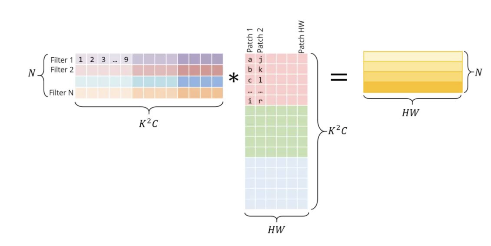
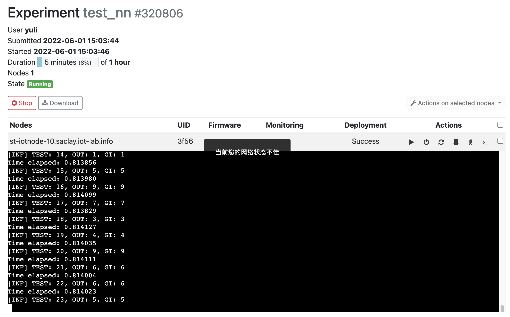

# PROJ4——神经网络运算优化

Pythorch，一个神经网络编译器/运行时

## 实验目标

搭建一套编译工具以支持将简单的Pytorch CNN模型部署到x86计算机ARM Cortex-M架构的嵌入式设备，并探索各种加速模型推理的手段。

本项目参考并运用了《PROJ4——神经网络运算优化》提供的示例代码。

## 构建开发/测试流程

由于条件所限，项目需要在Darwin/Linux系统上进行。因此，我们首先将项目资料中基于Visual Studio的代码转换成CMake工程的。这一过程中，我们创建了`CMakeLists.txt`，并进行了模块的重新划分。

- `MNIST_PYTHORCH_C/cc`保存神经网络的模块/通用函数
- `MNIST_PYTHORCH_C/python` 一个`编译器`，可以从pytorch模型生成C函数
- `MNIST_PYTHORCH_C/tests` 一些测试工程
- `ci` 自动测试脚本

我们首先根据示例代码，构建测试流程。测试脚本为位于`./ci`目录下。测试大体上分为两个阶段：

1. 借助PyTorch训练模型，验证模型的准确率。导出C代码
2. 使用导出的代码编译C程序，目标平台分别是x86和Arm

### 依赖

为了训练MNIST手写数字识别模型，我们需要在环境中安装Python。我们还需要安装`torch`，`matplotlib`，`ipython`等Python软件包来训练/导出模型。这些都是示例代码的依赖。此外为了查看模型的结构和参数大小，我们使用了`torch-summary`软件包。该软件包可以用`pip install torch-summary`安装。

> 使用`pip install -r requirements.txt`命令，从项目中的`requirements.txt`安装项目的依赖

为了使用AVX指令集，运行的平台需要有支持AVX技术的处理器。并且编译器需要支持AVX指令。我们测试了`gcc@9.4.0`和`clang@10.0.0`两种编译器，它们均支持`-mavx`参数

为了编译ARM架构的可执行程序，我们需要安装`arm-none-eabi-gcc`工具链。该工具可以从[Arm GNU Toolchain Download](https://developer.arm.com/downloads/-/arm-gnu-toolchain-downloads)下载

在构建STM32工程时，我们使用了[STM32CubeMX](https://www.st.com/zh/development-tools/stm32cubemx.html)，这是一款ST公司出品的自动生成STM32项目的工具。通过图形化的界面就可以对各种STM32芯片的外设进行配置，并导出适用于GNU Toolchain的Makefile工程。然而为了运行项目，STM32CubeMX并不是必须的。

若要构建该工程并得到产物，有以下两种途径

1. 在UNIX系统中构建
2. 使用Docker环境构建

### 1. 在UNIX系统中构建

使用`ci`目录下的bash脚本，可以一键执行从模型训练到C代码编译、测试的全部流程。这些脚本在Ubuntu上进行了测试。

首先，将目录切换到工程的根目录，该目录下应该有`READNE.md`，`requirements.txt`等文件和`ci`，`MNIST_PYTHORCH_C`子目录

若要训练模型并生成x86架构的C程序，请依次执行`ci/generate_code.sh`，`ci/build_cmake.sh`

```shell
bash ./ci/generate_code.sh
bash ./ci/build_cmake.sh
```

这将会产生以下内容

- `MNIST_PYTHORCH_C/build/`下的`test_compiler`, `mnist_example`等可执行文件，`test_compiler.log`，`mnist_example.log`对应推理结果
- `MNIST_PYTHORCH_C/test/train_model/export_code`导出的C函数`calc_fn.c/h`、测试数据`test_data.c/h`和模型权重`calc_param.c/h`
- `MNIST_PYTHORCH_C/test/train_model/export_model`导出的Pytorch模型


若要训练模型并生成x86架构的C程序，请依次执行`ci/generate_code_stm32.sh`，`ci/build_stm32.sh`

```shell
bash ./ci/generate_code.sh
bash ./ci/build_cmake.sh
```

这将会产生以下内容

- `MNIST_PYTHORCH_C/test/test_stm32/build`下的`stm32l475vgtx.elf`固件，可以烧录到开发板上运行
- `MNIST_PYTHORCH_C/test/train_model/export_code_stm32`导出的C函数`calc_fn.c/h`、测试数据`test_data.c/h`和模型权重`calc_param.c/h`。该函数经过优化，体积更小。
- `MNIST_PYTHORCH_C/test/train_model/export_model_stm32`导出的Pytorch模型。该模型经过优化，体积更小。

### 2. 使用Docker环境构建

使用我们为该工程创建的镜像，可以简化环境配置过程。这要求目标计算机上拥有Docker运行时。[Get Docker](https://docs.docker.com/get-docker/)有各平台获取Docker的指南。以Ubuntu系统为例，运行下列命令可以安装Docker并将当前用户添加到Docker用户组：

```shell
curl -fsSL https://get.docker.com -o get-docker.sh
sudo sh get-docker.sh
sudo usermod -aG docker $USER
newgrp docker
sudo systemctl restart docker
```

使用`docker pull`命令，可以下载为该工程配置的镜像。该镜像托管在[hub.docker.com](https://hub.docker.com/r/davidliyutong/sjtu-embsys)：

```shell
docker pull davidliyutong/sjtu-embsys:latest
```

也可以从项目的`ci/sjtu-embsys`目录构建镜像：

```shell
docker build -t davidliyutong/sjtu-embsys:latest ./ci/sjtu-embsys
```

使用`docker image ls`确保计算机中存在`davidliyutong/sjtu-embsys:latest`镜像，然后在工程的根目录使用以下命令生成产物

```shell
docker run -it --rm --name mnist_pythorch_c --user=$UID:$(id -g $USER) \
       -v $(pwd):/opt/embsys/sjtu-embsys-2022 davidliyutong/sjtu-embsys:latest \
       bash -c "cd /opt/embsys/sjtu-embsys-2022 && bash ./ci/generate_code.sh && bash ./ci/generate_code_stm32.sh && bash ./ci/build_cmake.sh && bash ./ci/build_stm32.sh"
```

命令的解释：`--user=$UID:$(id -g $USER)`参数使用当前用户执行容器，防止产物带上root权限；`-v $(pwd):/opt/embsys/sjtu-embsys-2022`参数将当前目录（工程根目录）映射到容器内的`/opt/embsys/sjtu-embsys-2022`。容器会依次执行`ci`目录下的脚本。容器中的产物（二进制/C代码/Pytorch模型）会在容器运行完毕后保留。

`ci/bootstrap.sh`中记录了该`docker run`命令。在工程根目录运行`ci/bootstrap.sh`可以起到相同的效果，并且会生成`mnist_pythorch.tar.gz`打包所有的产物

### 清理

`ci/clean.sh`中记录了删除所有工程产物的命令。在工程根目录运行`ci/clean.sh`可以删除所有工程产物。

## 问题约束

我们的理想是设计一套将任意Pytorch模型转换为C代码的机制。然而Pytorch采取了动态计算图（Eager Mode)。在动态计算图中，参与计算的元素不仅有Pytorch Module，还包括了Pytorch Function、Python对象甚至是Numpy数组。Pytorch动态图的这种特性对语法解析工作提出了巨大挑战。考虑到项目时间有限，不可能覆盖针对种种复杂情况进行测试。我们决定将问题约束如下：

1. 转换的对象是`torch.nn.Sequential`模型。这种模型是一系列模块的顺序组合
2. 转换仅支持这些模块`nn.Conv2D`,`nn.Linear`,`nn.MaxPool2d`,`nn.AvgPool2d`,`nn.ReLU`,`nn.Flattern`,`nn.Sigmoid`,`nn.Tanh`。其中`nn.AvgPool2d`,`nn.Sigmoid`,`nn.Tanh`优先级次之
3. 只考虑float32类型数据的计算

以课程示例例为例。示例中的模型可以用nn.Sequenctial包装如下

```python
nn.Sequential(
    nn.Conv2d( 1, 32, 5, 1),
    nn.ReLU(),
    nn.MaxPool2d(2),
    nn.Conv2d(32, 32, 5, 1),
    nn.ReLU(),
    nn.MaxPool2d(2),
    nn.Flatten(1),
    nn.Linear(512, 1024),
    nn.ReLU(),
    nn.Dropout(0.4),
    nn.Linear(1024, 10),
)
```


## 编译Pytorch模型为C代码

示例中给出了一种将Pytorch模型转换为C代码的方法：

- 模型权重被导出到`export_code/param.c`中，并在`export_code/param.h`声明
- 模型的部分测试数据被导出到`export_code/test_data.c`中，并被编译进了程序

我们按照这个思路，对示例代码进行了扩展。构造的编译器可以一次分析`nn.Sequential`模型的各个子模型，通过正则表达式将它们与对应的模版匹配。并将子模块路由到相应的处理模块进行处理。这里以最复杂的`Conv2d`模块的处理为例。该模块的对应处理函数如下

```python
    @classmethod
    def get_conv2d(cls, context, component: nn.Module):
        """处理Conv2d模块

        Args:
            context (_type_): 编译上下文
            component (nn.Module): Conv2d模块

        Returns:
            CompilerToken: CompilerToken
        """

        layer_id: str = context["id"]
        op: str = "conv2d" + "_" + context["dtype"]  # PYTHORCH_CONV2D_OP
        in_num_c, in_hgt, in_wid = context["in_shape"][
            1:4
        ]  # PYTHORCH_CONV2D_ID_IN_HGT, PYTHORCH_CONV2D_ID_IN_WID
        # PYTHORCH_CONV2D_ID_WEIGHT
        # PYTHORCH_CONV2D_ID_BIAS
        # PYTHORCH_CONV2D_ID_SHAPE
        dout = context["dout"]
        din = context["din"]

        state_dict = component.state_dict()

        # 计算需要给im2col保留的缓冲区大小
        pad = 0
        stride = 1
        k_hgt, k_wid = state_dict["weight"].shape[2:4]  # 卷积核
        height_col = (in_hgt + 2 * pad - k_hgt) / stride + 1
        width_col = (in_wid + 2 * pad - k_wid) / stride + 1
        channels_col = in_num_c * k_hgt * k_wid
        dbuf = context["app"] + cls.buf_postfix
        dbuf_sz = height_col * width_col * channels_col

        free_variables = [context["din"]]
        context["din"] = context["dout"]
        context["dout"] = ""

        res = f"{op}({dout}, {din}, {in_hgt}, {in_wid}, {op}_{layer_id}_weight, {op}_{layer_id}_bias, {op}_{layer_id}_shape, {dbuf});"
        return CompilerToken(
            c_fn=res,
            c_params={
                f"{op}_{layer_id}_weight": state_dict["weight"],
                f"{op}_{layer_id}_bias": state_dict["bias"],
                f"{op}_{layer_id}_shape": state_dict["weight"].shape,
            },
            out_shape=cls.get_out_shape(component, context["in_shape"]),
            free_vars=free_variables,
            buf_claim=dbuf_sz,
        )
```

最终该函数将会生成一行C语句、记录Conv2d的权重、计算Conv2d的输出尺寸，输出Conv2d释放的变量名称和需求的临时变量大小。

值得注意的是，我们不需要处理Flattern，因为Flattern是对张量形状的处理

以此类推，我们处理所有支持的Pytorch模块，最后生成一个这样的函数。该函数是nn.Sequential对象的等价

```c
#include "pythorch/pythorch.h"
#include "calc_params.h"
__attribute__ ((aligned (32))) float var_0[18432];
__attribute__ ((aligned (32))) float var_1[18432];

pythorch_err_t calc_fn(float* din, float* dout) {

    pythorch_err_t err = PYTHORCH_OK;

    conv2d_f32(var_0, din, 28, 28, conv2d_f32_0_weight, conv2d_f32_0_bias, conv2d_f32_0_shape, calc_g_buf);
    relu_f32(var_1, var_0, 18432);
    maxpool2d_f32(var_0, var_1, 24, 24, 32, 2);
    conv2d_f32(var_1, var_0, 12, 12, conv2d_f32_3_weight, conv2d_f32_3_bias, conv2d_f32_3_shape, calc_g_buf);
    relu_f32(var_0, var_1, 2048);
    maxpool2d_f32(var_1, var_0, 8, 8, 32, 2);
    /** Flatten **/
    linear_f32(var_0, var_1, linear_f32_7_weight, linear_f32_7_bias, linear_f32_7_shape);
    relu_f32(var_1, var_0, 1024);
    /** Dropout **/
    linear_f32(dout, var_1, linear_f32_10_weight, linear_f32_10_bias, linear_f32_10_shape);

    return err;

}
```

其中`pythorch/pythorch。h`是整个推理库的头文件，引入该头文件并链接推理库就可以使用。该推理库的设计于下一章节叙述。`__attribute__ ((aligned (32))) `是为AVX指令准备的。我们可以看到，自始至终只有两个临时变量var_0和var_1被用来保存的中间结果，这是因为我们处理的是一个序列，并不涉及到复杂的计算图。在复杂的计算图中，可能需要多个变量保存中间结果。

对于测试数据集，我们决定沿用示例代码中将测试数据保存在`test_data.c/h`文件中的做法。这主要是为了测试的便利性。在模型的实际的运用中，图像数据应该从磁盘读取、网页上传获取或者摄像头模块捕捉。

## C神经网络推理库

我们修改了整理了资料中出现的神经网络算子，将其组织在`MNIST_PYTHORCH_C`目录下：

- `avx_mathfun.h` 使用AVX指令实现的数学函数(sin/cos/exp等)
- `CMakeLists.txt` 定义了pythorch库
- `conv.c/h` conv2d的帮助函数，主要包括im2colsnuff
- `gemm.c/h` 通用矩阵乘法函数
- `moduels.c/h` conv2d/linear/maxpool2d等算子。所有算子都有后缀标明适用的数据类型
- `pythorch.h` 头文件集合
- `utils.c/h` `calc_error`函数以及一些自定义类型

具体的加速手段如下

- 对于所有的激活函数，使用AVX指令集进行加速。
- 对于Linear算子的向量点积，使用AVX指令集进行加速。
- 将卷积输入使用im2col算法处理成二维矩阵，将卷积问题转化成GEMM问题
- 针对GEMM操作，运用AVX/分块实现优化
- 对于池化层，采取策略减少数组下标的计算

im2col是将一个`[C,H,W]`矩阵变成一个`[H,W]`矩阵的一个方法，其原理是利用了行列式进行等价转换。im2col需要一个临时空间保存转换后的输入图像。在有MMU的平台上，这段内存可以用malloc动态分配，但是嵌入式设备的动态内存分配可能会导致不稳定。我们选择分配一个固定地址的静态空间作为缓冲。

下图展示了im2col算法的具体过程（图片来自互联网）



### 对比测试

对于推理算子的效能分析在一台Hyper-V虚拟机上进行。该虚拟机分配了4GiB内存，4个vCPU(i5-8400)。该型号CPU支持AVX2指令集，即256bit的并行指令。我们在虚拟机上安装了Ubuntu 20.04操作系统，编译器是clang@10.0.0。测试过程中使用`time`命令计时并将输出重定向到文件到文件。

首先，我们在不进行任何优化的情况下以Debug模式编译并执行推理程序。推理500张图片耗时6.705s。

```
real    0m6.710s
user    0m6.705s
sys     0m0.004s
```

我们将CMake工程调整到Release模式，这将启用编译器的优化。推理耗时下降到了1.308s(-5.397)。接下来的实验均在Release模式下进行

```
real    0m1.321s
user    0m1.308s
sys     0m0.012s
```

我们为代码添加AVX支持并通过添加`-mavx`启用AVX加速。推理耗时下降到了1.023s(-0.285)。

```
real    0m1.023s
user    0m1.023s
sys     0m0.000s
```

我们将卷积操作利用im2col算法转换成矩阵乘法(`-DDOPTIMIZE_IM2COL`)。推理耗时下降到了0.215s(-0.808)。注意，此时的矩阵乘法是较为naive的实现，但也考虑到了访存的优化，调整了循环的次序。

```c
for (int i = 0; i < m_hgt; i++){}
    for (int k = 0; k < n_hgt; k++)
        for (int j = 0; j < n_wid; j++)
            dout[i * n_wid + j] += m[i * m_wid + k] * n[k * n_wid + j];
```

```
real    0m0.220s
user    0m0.215s
sys     0m0.004s
```

在加入GEMM的基础上，我们调整了池化层的算法，尽可能消除了下标的计算。推理耗时下降到了0.206s(-0.009)

```
real    0m0.209s
user    0m0.206s
sys     0m0.004s
```

我们对卷积过程中出现的矩阵乘法使用AVX指令进行优化(`-DDOPTIMIZE_GEMM_AVX=1`)。推理耗时下降到了0.142s(-0.009)
开AVX + IM2COL + 消除下标 + GEMM 优化(向量化)

```
real    0m0.142s
user    0m0.142s
sys     0m0.000s
```

进一步考虑到缓存的局部性，我们使用所有16个YMM寄存器，将矩阵乘法拆成8x8的小块进行计算(`-DDOPTIMIZE_GEMM_AVX=2`)。推理耗时下降到了0.127s(-0.015)

```
real    0m0.127s
user    0m0.127s
sys     0m0.000s
```

至此，面向x86平台的SIMD优化过程告一段落。我们将程序的执行耗时从6.705s缩短到0.127s。其中，比较有效的方法是开启编译器优化、使用IM2COL计算卷积、使用AVX指令这三种。

我们还可以使用Perf工具分析最终加速方法的性能。

```bash
$ sudo perf stat ./MNIST_PYTHORCH_C/build/test_compiler > /dev/null

 Performance counter stats for './MNIST_PYTHORCH_C/build/test_compiler':

            126.47 msec task-clock                #    0.998 CPUs utilized          
                 0      context-switches          #    0.000 /sec                   
                 0      cpu-migrations            #    0.000 /sec                   
               212      page-faults               #    1.676 K/sec                  
   <not supported>      cycles                                                      
   <not supported>      instructions                                                
   <not supported>      branches                                                    
   <not supported>      branch-misses                                               

       0.126758472 seconds time elapsed

       0.126812000 seconds user
       0.000000000 seconds sys

$ sudo perf stat -e cpu-clock,context-switches,cpu-migrations,page-faults,cycles,instructions,L1-dcache-load-misses -r 10 ./MNIST_PYTHORCH_C/build/test_compiler > /dev/null

 Performance counter stats for './MNIST_PYTHORCH_C/build/test_compiler' (10 runs):

            140.47 msec cpu-clock                 #    0.998 CPUs utilized            ( +-  4.43% )
                 1      context-switches          #    7.119 /sec                     ( +- 39.44% )
                 0      cpu-migrations            #    0.712 /sec                     ( +-100.00% )
               212      page-faults               #    1.511 K/sec                    ( +-  0.31% )
   <not supported>      cycles                                                      
   <not supported>      instructions                                                
   <not supported>      L1-dcache-load-misses                                       

           0.14077 +- 0.00620 seconds time elapsed  ( +-  4.41% )

```

可以看到，由于我们在虚拟机中测试程序，无法获得指令数。

## 面向嵌入式设备的部署

### 选择目标平台

我们选择基于Cortex-M4架构的 stm32l475 MCU 移植手写数字识别模型。选择该平台的原因有：

- 该系列MCU配备有DSP模块。
- 在线测试平台`Iot-Lab`提供基于该MCU的开发版，可以上传程序并得到结果

### 减小模型体积

无论采用哪种优化方法，首要的工作都是减少模型权重数量。为此，我们减少了卷积层的通道数量，并且移除了一个全连接层。模型现在结构如下

```python
    self.seq = nn.Sequential(
        nn.Conv2d( 1, 8, 5, 1),
        nn.ReLU(),
        nn.MaxPool2d(2),
        nn.Conv2d(8, 8, 5, 1),
        nn.ReLU(),
        nn.MaxPool2d(2),
        nn.Flatten(1),
        nn.ReLU(),
        nn.Linear(128, 10),
    )
```

使用`torch-summary`工具追踪模型各层权重，得到如下结果

```text
==========================================================================================
Layer (type:depth-idx)                   Output Shape              Param #
==========================================================================================
├─Sequential: 1-1                        [-1, 10]                  --
|    └─Conv2d: 2-1                       [-1, 8, 24, 24]           208
|    └─ReLU: 2-2                         [-1, 8, 24, 24]           --
|    └─MaxPool2d: 2-3                    [-1, 8, 12, 12]           --
|    └─Conv2d: 2-4                       [-1, 8, 8, 8]             1,608
|    └─ReLU: 2-5                         [-1, 8, 8, 8]             --
|    └─MaxPool2d: 2-6                    [-1, 8, 4, 4]             --
|    └─Flatten: 2-7                      [-1, 128]                 --
|    └─ReLU: 2-8                         [-1, 128]                 --
|    └─Linear: 2-9                       [-1, 10]                  1,290
==========================================================================================
Total params: 3,106
Trainable params: 3,106
Non-trainable params: 0
Total mult-adds (M): 0.22
==========================================================================================
Input size (MB): 0.00
Forward/backward pass size (MB): 0.04
Params size (MB): 0.01
Estimated Total Size (MB): 0.05
==========================================================================================
```

可以看到，我们的模型现在只有3.1k个参数，运行需要50KB左右的内存。

由于我们的`Compiler.py`实现了针对`SequentialModule`的泛用编译，因此生成的代码将自动调整以适应模型结构的变化。经过测试，在x86平台上，缩小后的模型完成500个样本推理仅需要0.019s，并保持99%以上的准确率。

### 在IoT-Lab测试

IoT-Lab是一个在线的IoT测试平台，用户可以利用该平台启动数十个IoT开发版进行IoT实验。该平台免费向研究者开放。平台上提供了`ST B-L475E-IOT01A`这款开发版。它有一颗基于Cortex-M4架构的stm32l475vgtx MCU。


启动STM32CubeMX，使用图形化界面配置stm32l475vgtx的各项参数，然后生成Makefile工程。我们暂时只需要使用USART1这一个外设。


以下是主要的注意事项

- 由于我们使用的是arm-none-eabi-gcc编译器，因此为了将printf重定向到串口，需要实现`int _write(int fd, char *ptr, int len)`函数

```c
int _write(int fd, char *ptr, int len)  
{  
  HAL_UART_Transmit(&huart1, (uint8_t*)ptr, len, 0xFFFF);
  return len;
}
```
- 我们需要在`LDFLAGS`中指定`-u_printf_float`参数来使能浮点数打印以便调试
- 我们需要在`C_DEFS`中添加`__TARGET_FPU_VFP`定义来使能浮点单元

我们将原本在`mnist.c`中存在的推理函数拷贝到stm32工程的`main.c`中。该文件位于`MNIST_PYTHORCH_C/tests/test_stm32/main.c`路径下


我们可以看到，STM32程序如预期的那样正在执行推理函数，但是速度非常缓慢，需要2.7秒才能处理一帧图像。


### 优化

如果要在STM32等嵌入式平台运行该模型，需要对模型进行进一步优化。主要的思路有一下两种：

- 将浮点数转化成定点数
- 使用INT8类型的权重数据进行量化

我们还可以使用ARM发布的`CMSIS.NN`库和`CMSIS.DSP`库在软件层面进行优化。具体来说，我们可以启用IM2COL算法，将卷积转化为矩阵乘法然后用`arm_mat_mult_f32`加速矩阵计算

为了不降低模型精度，我们没有选择对模型量化，而是选择从软件层面优化。如下图所示，使用了IM2COL算法和`arm_mat_mult_f32`库函数后，推理一帧的时间下降到了0.8s



## Acknowledgement

以下代码属于EST0601嵌入式系统课程的内容，其版权归属其创作者所有：

- `MNIST_PYTHORCH_C/train_model/main.py`
- `MNIST_PYTHORCH_C/mnist.c`
## Reference

[The Very Large Scale IoT Testbed](https://www.iot-lab.info/)
[Intel Intrinsics Guide](https://www.intel.com/content/www/us/en/docs/intrinsics-guide/index.html)
[通用矩阵乘法及其优化](https://lzzmm.github.io/2021/09/10/GEMM/)