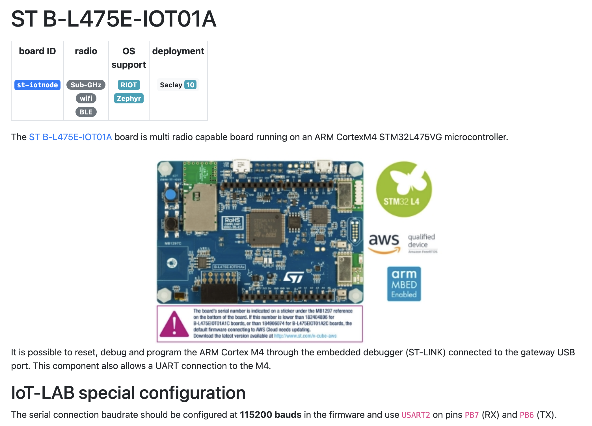
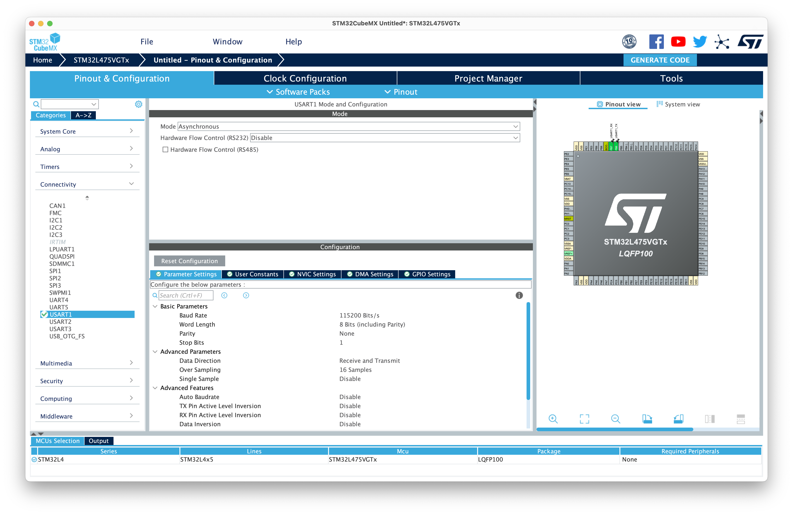
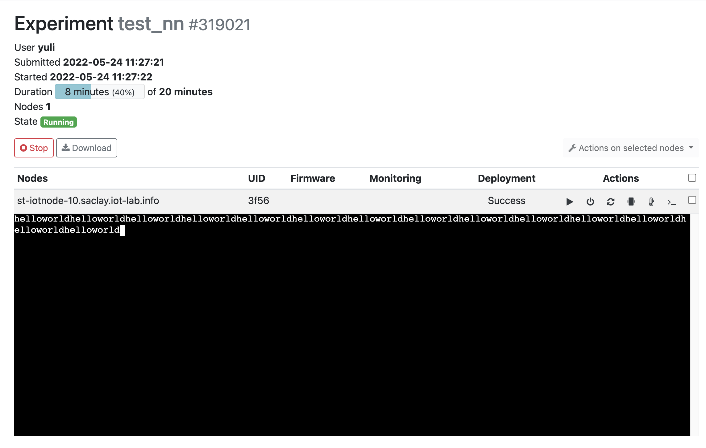

# 神经网络运算优化

## Target

目标：搭建一套编译工具以支持将简单的Pytorch CNN模型迁移到ARM Cortex-M架构的嵌入式设备运行
进阶目标：在完成主要目标的基础上，探索各种加速手段

预计支持的算子

- Conv2D
- Linear
- MaxPool2d
- ReLU
- Flattern
- ArgMax

未来

- AvgPool2d
- Sigmoid
- Tanh

## RoadMap

- [ ] 完成VS项目到CMake项目的迁移
- [ ] 完成x86_64架构下的测试
- [ ] 完成QEMU虚拟机下的ARM测试
- [ ] 搭建

## 构建测试流程

由于条件所限，项目需要在Darwin/Linux系统上开展。因此，我们首先将基于Visual Studio的代码转换为基于CMake的。这一过程中，我们创建了CMakeLists，进行了模块的重新划分。

我们首先根据示例代码，构建持续集成测试。测试脚本位于`./ci`目录下。测试大体上分为两个阶段：

1. 借助PyTorch训练模型，验证模型的准确率。导出C代码
2. 使用导出的代码编译

## 问题约束

我们的理想是设计一套将任意Pytorch模型转换为C代码的机制。然而Pytorch采取了动态计算图（Eager Mode)。在动态计算图中，参与计算的元素不仅有Pytorch Module，还包括了Pytorch Function、Python对象甚至是Numpy数组。Pytorch动态图的这种特性对语法解析工作提出了巨大挑战。考虑到项目时间有限，不可能覆盖针对种种复杂情况进行测试。我们决定将问题约束如下：

1. 转换的对象是`torch.nn.Sequential`模型。这种模型是一系列模块的顺序组合
2. 转换仅支持这些模块`nn.Conv2D`,`nn.Linear`,`nn.MaxPool2d`,`nn.AvgPool2d`,`nn.ReLU`,`nn.Flattern`,`nn.Sigmoid`,`nn.Tanh`。其中`nn.AvgPool2d`,`nn.Sigmoid`,`nn.Tanh`优先级次之
3. 只考虑float32类型数据的计算

以课程示例例为例。示例中的模型可以用nn.Sequenctial包装如下

```python
nn.Sequential(
    nn.Conv2d( 1, 32, 5, 1),
    nn.ReLU(),
    nn.MaxPool2d(2),
    nn.Conv2d(32, 32, 5, 1),
    nn.ReLU(),
    nn.MaxPool2d(2),
    nn.Flatten(1),
    nn.Linear(512, 1024),
    nn.ReLU(),
    nn.Dropout(0.4),
    nn.Linear(1024, 10),
)
```

我们也沿用了示例代码中将测试数据保存在`test_data.c/h`文件中的做法。这主要是为了测试的便利性。在模型的实际的运用中，图像数据应该从摄像头模块获取。

## 编译Pytorch模型为C代码

示例中给出了一种将Pytorch模型转换为C代码的方法：

- 模型权重被导出到`export_code/param.c`中，并在`export_code/param.h`声明
- 模型的部分测试数据被导出到`export_code/test_data.c`中，并被编译进了程序

我们按照这个思路，对示例代码进行了扩展。构造的编译器可以一次分析`nn.Sequential`模型的各个子模型，通过正则表达式将它们与对应的模版匹配。并将子模块路由到相应的处理模块进行处理。例如

```python
@classmethod
def get_conv2d(cls, context, component: nn.Module):

    layer_id: str = context['id']
    op: str = 'conv2d' + '_' + context['dtype']  # PYTHORCH_CONV2D_OP
    in_hgt, in_wid = context['in_shape'][2:4]  # PYTHORCH_CONV2D_ID_IN_HGT, PYTHORCH_CONV2D_ID_IN_WID
    # PYTHORCH_CONV2D_ID_WEIGHT
    # PYTHORCH_CONV2D_ID_BIAS
    # PYTHORCH_CONV2D_ID_SHAPE
    dout = context['dout']
    din = context['din']

    state_dict = component.state_dict()
    
    free_variables = [context['din']]
    context['din'] = context['dout']
    context['dout'] = ''

    res = f"{op}({dout}, {din}, {in_hgt}, {in_wid}, {op}_{layer_id}_weight, {op}_{layer_id}_bias, {op}_{layer_id}_shape);"
    return res, \
            {f'{op}_{layer_id}_weight': state_dict['weight'], f'{op}_{layer_id}_bias': state_dict['bias'], f'{op}_{layer_id}_shape': state_dict['weight'].shape}, \
            cls.get_out_shape(component, context['in_shape']), \
            free_variables
```

...

## 在IoT-Lab测试






